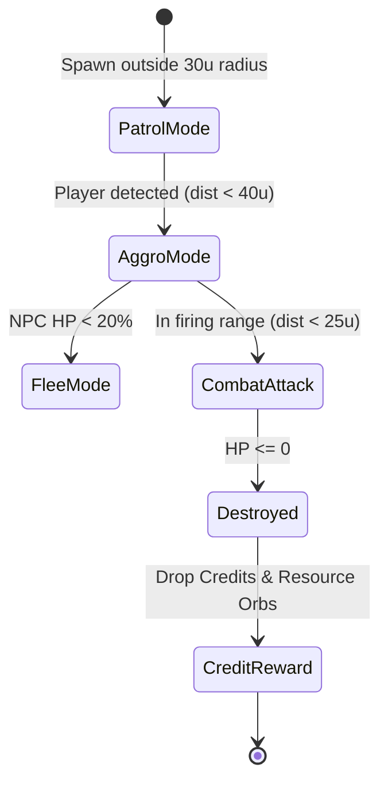

# 👾 NPC SYSTEM MECHANICS MASTER PLAN (`NPC_PLAN.md`)

---

## 1. Executive Summary

Dokumen ini merancang **Sistem NPC Enemy (Kroco, Elit, dan Boss)** pada permukaan planet (Surface Engine) dan War Zone. NPC akan muncul secara berkala (*periodic spawn*), memiliki algoritma kecerdasan buatan (*patrol, aggro, flee*), serta melepaskan **Kredit & Resource Drop** ketika dihancurkan untuk digunakan di **Space Tech Shop**.

---

## 2. NPC Hierarchy & Catalog

```
NPC ENEMY HIERARCHY
├── 👾 KROCO (Minions / Drones)
│   ├── Geth Trooper Scout (HP: 30 | DMG: 1 | Speed: Fast | Drop: 15-25 Credits)
│   └── Reaper Harvester Drone (HP: 25 | DMG: 1.5 | Speed: Very Fast | Drop: 20 Credits)
│
├── 🛡️ ELITE (Captains / Armatures)
│   ├── Geth Armature Walker (HP: 90 | DMG: 3 | Speed: Medium | Drop: 60-80 Credits)
│   └── Cerberus Centurion (HP: 110 | DMG: 4 | Speed: Medium | Drop: 90 Credits + 5 Eezo)
│
└── ☠️ BOSS (Titan / Colossus)
    └── Geth Siege Colossus (HP: 300 | DMG: 7 | Speed: Slow | Drop: 300 Credits + 25 Eezo + 25 Plat)
```

---

## 3. Spawning Logic & Population Density

### ⚖️ Spawning Balancing Rules
- **Planet Pasif (Farming Mode)**:
  - Total NPC aktif: **3 - 6 entitas** (Kroco saja).
  - Spawn Interval: Setiap **30 detik**.
- **Planet War Zone (War Mode)**:
  - Total NPC aktif: **10 - 15 entitas** (Campuran Kroco, Elit, dan 1 Boss per phase).
  - Spawn Interval: Setiap **12 detik**.
  - **Spawn Safety Zone**: NPC TIDAK AKAN spawn dalam radius 30 unit dari Normandy Landing Zone (LZ) atau posisi Mako pemain.

---

## 4. AI Movement & Combat Algorithms



### 🧠 3 Stase Perilaku AI:
1. **Patrol Mode (Wandering)**:
   - NPC bergerak mulus menuju waypoint acak (*smooth random heading interpolation*).
   - Menghindari obstacle (pohon & batuan) dengan raycasting sederhana.
2. **Aggro & Pursuit Mode**:
   - Jika Mako pemain masuk radius 40 unit, NPC memutar moncong meriam ke arah pemain.
   - Bergerak mengejar dan menembakkan laser plasma (efek suara & proyektil merah).
3. **Flee / Evasion Mode**:
   - Ketika HP NPC tersisa < 20%, NPC berbalik arah dan melarikan diri dari pemain.

---

## 5. Credit Reward & Drop Mechanics

Ketika HP NPC mencapai `0`:
1. **Visual Explosion**: Efek ledakan partikel 3D & efek suara `audioEngine.playImpact()`.
2. **Resource Drop**: Melepaskan Credit & Resource Orb berpendar di tempat ledakan.
3. **Auto Collect**: Mengambil orb menambahkan Kredit langsung ke wallet (`state.credits`) & pemberitahuan toast UI:
   `"👾 Target Destroyed! +75 Credits & +5 Platinum Added to Cargo!"`

---

## 6. Implementation Phases for AI Agent

### 📍 Phase A: NPC Data Catalog & Asset Models
- Membuat `src/data/npcs.js` (katalog stat Kroco, Elit, Boss).
- Menambahkan Mesh Generator NPC di `src/factories/modelRegistry.js`.

### 📍 Phase B: Spawner & AI Movement Engine
- Membuat `src/surface/npcManager.js` (spawning loop, patrol, aggro raycasting, combat lasers).
- Mengintegrasikan update loop di `surfaceEngine.js`.

### 📍 Phase C: Combat Hitbox & Credit Rewards
- Deteksi tembakan laser Mako terhadap NPC.
- Pengurangan HP NPC & efek ledakan saat mati.
- Penambahan kredit otomatis ke wallet `gameState.credits`.
